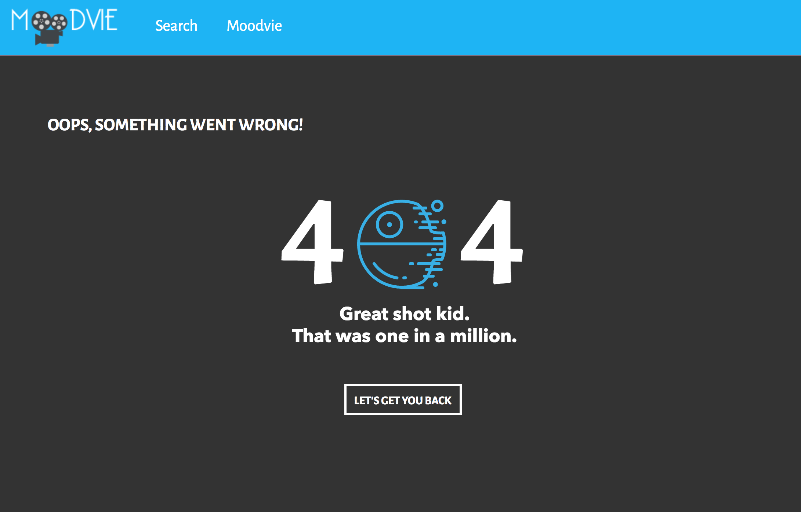
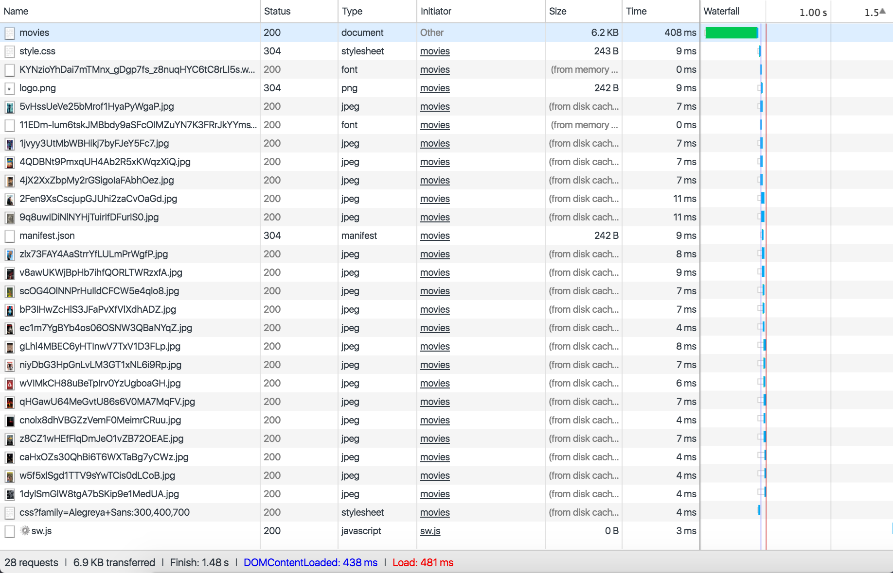
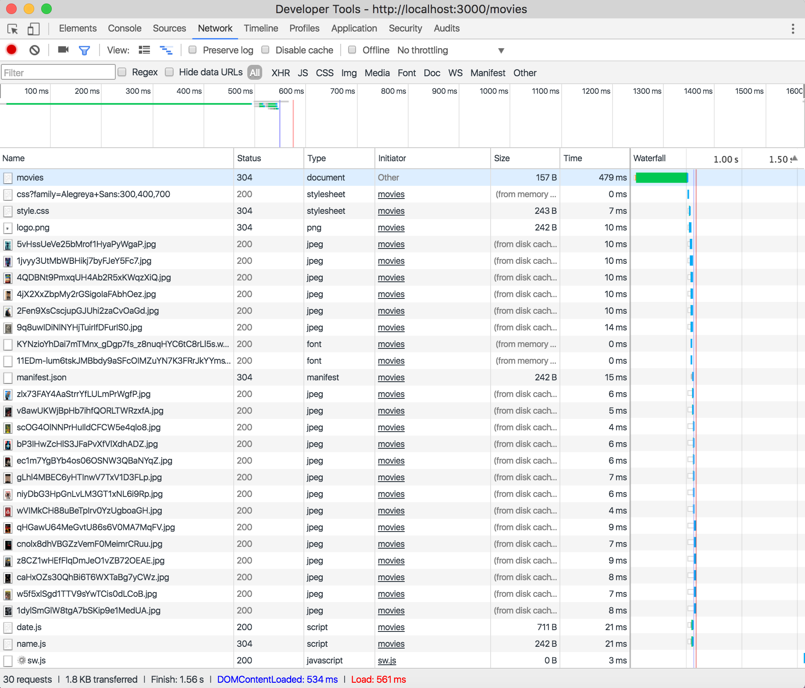

### Moodvie: a overview of movies

This project is about displaying movies from the Movie Database API.

For starters I put the search query on John, only displaying the movies with the name John in the title.
By clicking on the movie you will get the details from this movie.


This whole project is build in server-side, with a few client-side javascripts. I'm going to bundle these client-side script with [Browserify](https://www.npmjs.com/package/browserify).


### Features
- Search by query

### Wishlist
- Show more movies (now 20)
- 404 handling



---

## Get started
First clone the repo:
```git
git clone https://github.com/GiuliaM/performance-matters.git
cd week2/tmdb-api
```

After that:

```git
npm install
```

In my .env file I put my api key and search query like this:
```javascript
apiKey=?api_key=[ACTUALKEY];
searchApi=https://api.themoviedb.org/3/search/movie[apiKey]&query=john;

```

Now start up the server:
```git
npm start
```

If you are using nodemon (so you don't have to restart the server after you changed a file), do this:
```git
nodemon app.js
```
or if you use node
```git
node app.js
```

## Audit
Before adding any client-side JavaScript I did a speed check


After that the two client-side JavaScripts


After that the two client-side JavaScripts bundled with Browserify stored in bundle.js
