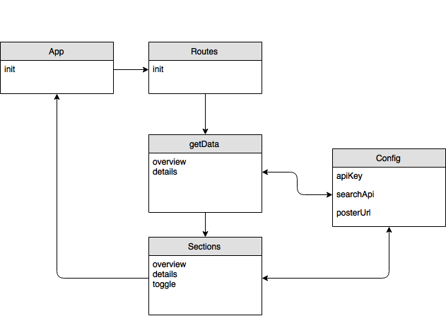
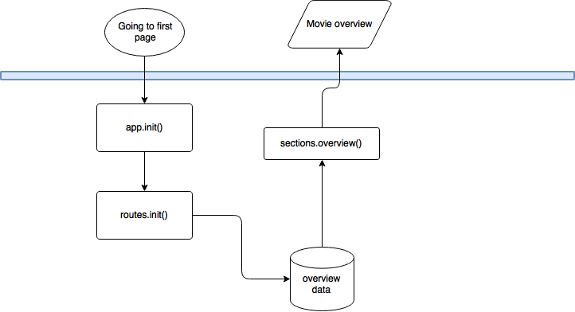

My API isn't done yet. Figuring out how to make an detailpage.

https://giuliam.github.io/wafs/opdracht6-api/?#start


<h1> Object Model </h1>



<h1> Flow Chart</h1>




## Get started
First clone the repo:
```git
git clone https://github.com/GiuliaM/performance-matters.git
cd week2/tmdb-api
```

After that:

```git
npm install
```

In my .env file I put my api key and search query like this:
```javascript
apiKey=?api_key=[ACTUALKEY];
searchApi=https://api.themoviedb.org/3/search/movie[apiKey];

```

Now start up the server:
```git
npm start
```

If you are using nodemon (so you don't have to restart the server after you changed a file), do this:
```git
nodemon app.js
```
or if you use node
```git
node app.js
```

